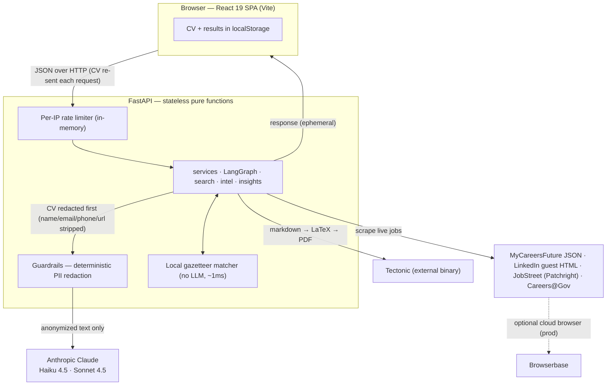
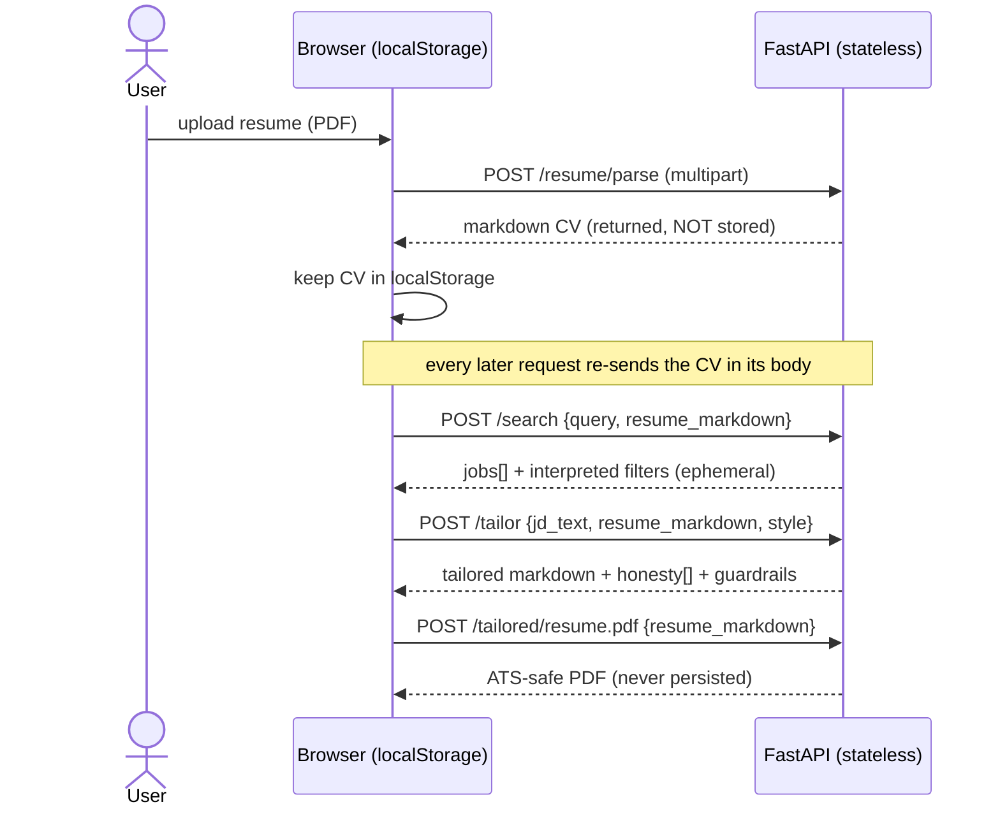
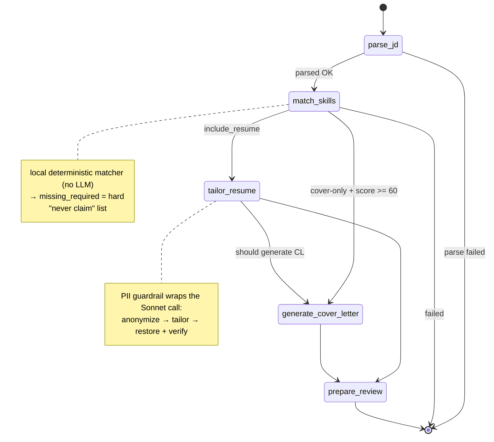
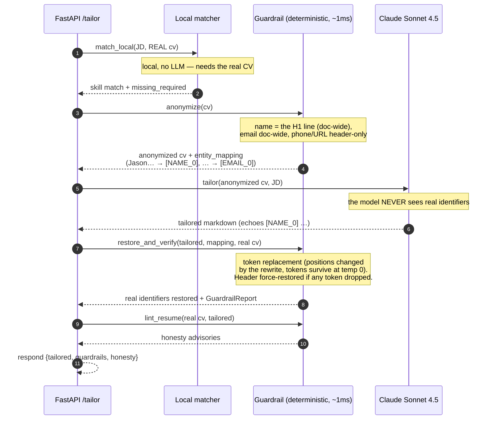
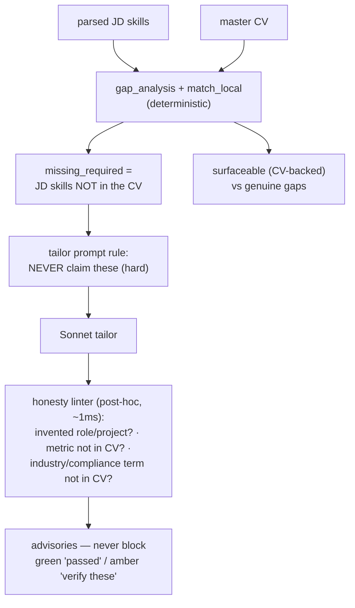
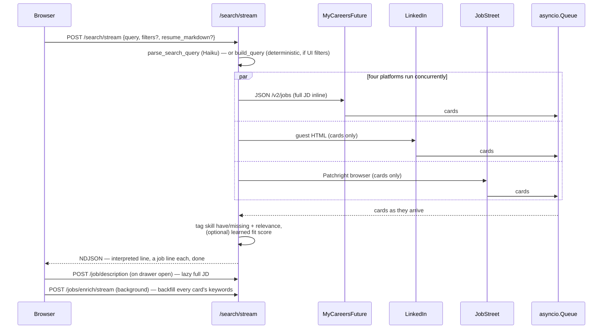
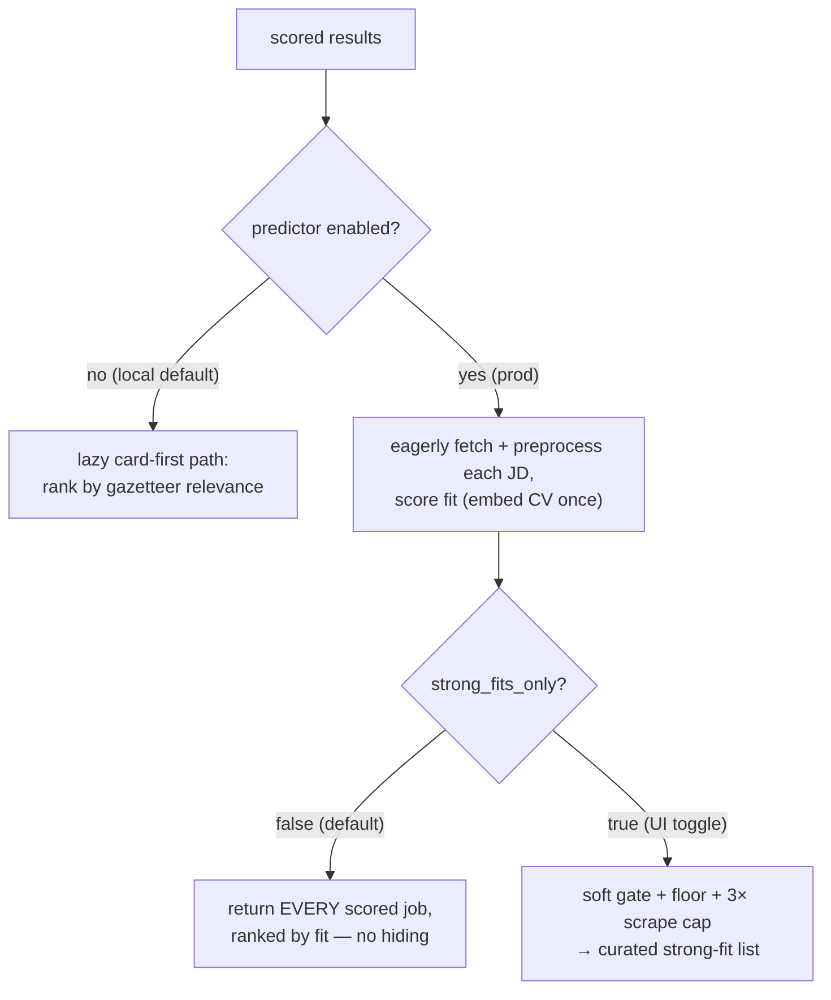
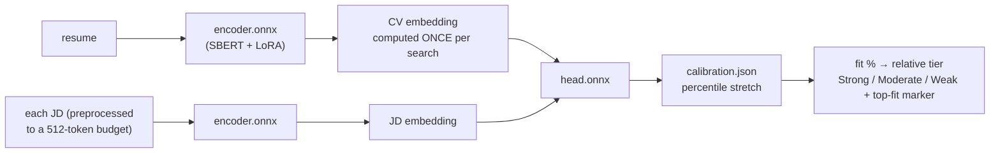
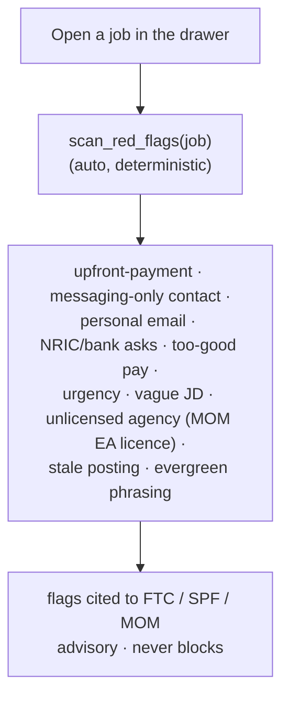
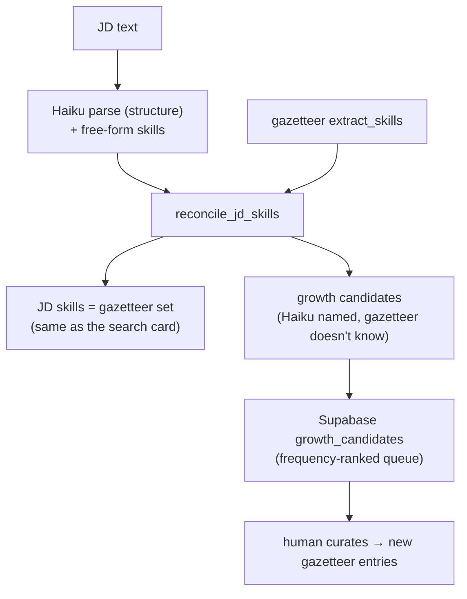

# Architecture

The technical companion to the [README](README.md). The README is the overview — *what* Overlap does; this document is the *how*: per-feature internals, the diagrams, and the design decisions behind them. Every diagram is Mermaid, so it renders inline on GitHub.

**Contents**

- [System overview](#system-overview)
- [Stateless request lifecycle](#stateless-request-lifecycle)
- [Resume tailoring pipeline](#resume-tailoring-pipeline)
- [PII guardrail](#pii-guardrail)
- [Honesty enforcement](#honesty-enforcement)
- [Live job search](#live-job-search)
- [Fit predictor](#fit-predictor)
- [Job-intel panel](#job-intel-panel)
- [Local matching engine](#local-matching-engine)

---

## System overview

A React SPA holds all state (CV + results) in `localStorage` and re-sends the CV in the body of every request. The FastAPI backend is a set of **pure functions of the request body** — no auth, no session, and no *user* data stored (the one exception is anonymous job-skill telemetry, below). It fans out to Claude for the language-heavy steps, a local deterministic matcher for scoring (no LLM), Tectonic for PDF, and four job scrapers.

**Design intent.** The whole app is a demo anyone can try instantly, so the constraints are: no state to leak, cheap models where quality doesn't matter (Haiku for parsing), quality models where it does (Sonnet for writing), and *deterministic* code — not an LLM — for anything that must be exact and repeatable (skill matching, honesty checks, red flags, PII detection).

---

## Stateless request lifecycle

The CV is uploaded once (PDF → markdown), returned to the client, and kept in `localStorage`. It is then re-sent in the body of every subsequent request. No user data is persisted server-side (the only write to a database is anonymous job-skill telemetry — see [Local matching engine](#local-matching-engine)).

---

## Resume tailoring pipeline

Tailoring is a **LangGraph state machine** with the master CV threaded through the state and conditional edges routing between steps.

- **`parse_jd`** (Claude **Haiku 4.5**) extracts the posting's required/preferred skills.
- **`match_skills`** runs the **local deterministic matcher** (no LLM) to split the JD's skills into what the CV supports vs. what it doesn't. The "doesn't" set becomes a hard **`missing_required`** list handed to the tailor.
- **`tailor_resume`** (Claude **Sonnet 4.5**) rewrites the resume — mirrors the JD's exact keyword wording *where the CV supports it*, preserves metrics, reorders by relevance, targets one page. The PII guardrail wraps this call (see below).
- **`generate_cover_letter`** (Sonnet, optional) is a separate on-demand step.

Two **styles** trade editorial latitude while keeping honesty rules identical: `faithful` (keep all, reorder/rephrase) and `aggressive` (restructure + cut, hard one page). A one-page budget estimator (calibrated so ~55 rendered lines ≈ one page) drives a live page-fit badge as you edit.

---

## PII guardrail

The CV is sent to Anthropic (a third party) to be tailored. Before it leaves, a **deterministic, dependency-free** guardrail strips the candidate's direct identifiers and the model tailors an *anonymized* copy; the real details are restored locally afterward. This is data minimization before a third-party LLM call — the "safe AI" story, enforced in code.

**Why deterministic, not NER.** The first build used Microsoft Presidio (spaCy NER). Running NER over the whole document mis-classified substance the tailor needs — it tagged *"AI"* as a location and *"PyTorch"* / a company name as a person — which forced an entity-exclusion list plus a skills-allowlist patch, and dragged in ~200 MB of model. Because a resume's identifiers live in the contact header (and the name is the `# ` H1 in this app's format), a **header-anchored deterministic** detector is lighter, exact-repeatable, on-brand with the rest of the app, and has *zero* body false positives.

**Restore is token replacement, not positional.** Presidio's de-anonymizer restores by character offset, but the tailor rewrites and reorders the text, invalidating offsets. The placeholder tokens themselves survive the rewrite verbatim (temperature 0), so we invert the mapping and replace tokens.

**Guarantees.** The contact header is force-restored from the original CV if any token fails to round-trip (so the PDF always carries the right details); and the whole layer **fails open** — any error tailors on the real CV rather than breaking the request. The same guardrail wraps the cover-letter call.

---

## Honesty enforcement

Honesty is **code-enforced, not just prompted**. The deterministic matcher decides what the tailor may claim *before* generation, and a deterministic linter checks the output *after*.

Fabrication means inventing *history* (a made-up role, a metric the CV never stated, a compliance domain never mentioned). Adding a JD *skill* to the Skills section for ATS coverage is the tailor's job and is explicitly allowed — the user opts in per skill via chips, with CV-backed skills shown green and not-yet-in-CV skills shown amber ("be ready to speak to these").

---

## Live job search

A natural-language query is parsed into structured filters, then four platforms are scraped **concurrently** and streamed to the client as results arrive.

To stay fast and avoid tripping platform soft-walls, LinkedIn/JobStreet return **cards only**; full descriptions are fetched **on demand** when a job is opened, and keywords are **backfilled in the background** after first render. Large searches spread a **weighted per-platform budget** so a fast source can't starve the slower ones.

When the optional fit predictor is on, the flow forks:

---

## Fit predictor

An optional bi-encoder (SBERT/MiniLM + LoRA) scores resume↔JD fit, exported to ONNX and split into a **two-tower** encoder + head so a search embeds the CV **once** rather than per job.

The headline stays **relative** (percentile within the current results), not a misleading absolute score — the signal is genuinely noisy (strong roles land ~40–85%, unrelated <15%).

---

## Job-intel panel

Opening a job runs a deterministic, stateless legitimacy scan — no LLM, ~1 ms.

---

## Local matching engine

`src/matching/` is a curated AI/ML/data/cloud **skills gazetteer** (canonical terms → aliases) plus a deterministic phrase matcher. It resolves `torch → PyTorch`, `k8s → Kubernetes`, handles `C++`/`C#`/`Node.js`, and avoids false hits (`java` inside `javascript`, a bare `go`). It powers per-job skill overlap, the tailoring pipeline's honesty gate, search ranking, insights, and the guardrail's skill awareness — **free, ~1 ms, exact-repeatable**, with no LLM call per job.

### One extractor for search and tailoring

The gazetteer is the **single source of a JD's skills**. Search cards and the tailor's match/score/chips all run the same `extract_skills`, so a job can't show one skill count on the card and a different one in the tailor. The Haiku JD parser still reads the JD's *structure* (title, company, seniority, responsibilities), but `reconcile_jd_skills` replaces its free-form skill lists with the gazetteer — and hands back the skills Haiku named that the gazetteer *doesn't* know as **growth candidates**.

Persistence (`src/growth.py`) is **fire-and-forget and fail-open** — a PostgREST RPC over HTTPS, scheduled off the request path so it never adds latency, and a no-op when Supabase isn't configured. The table stores only anonymous skill terms + an example job title (no user data). It's the first, deliberately tiny brick of a future job-market data platform: a review queue that turns "the gazetteer missed something" into a curation signal instead of a silent gap.
