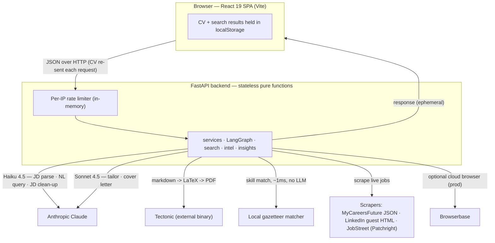
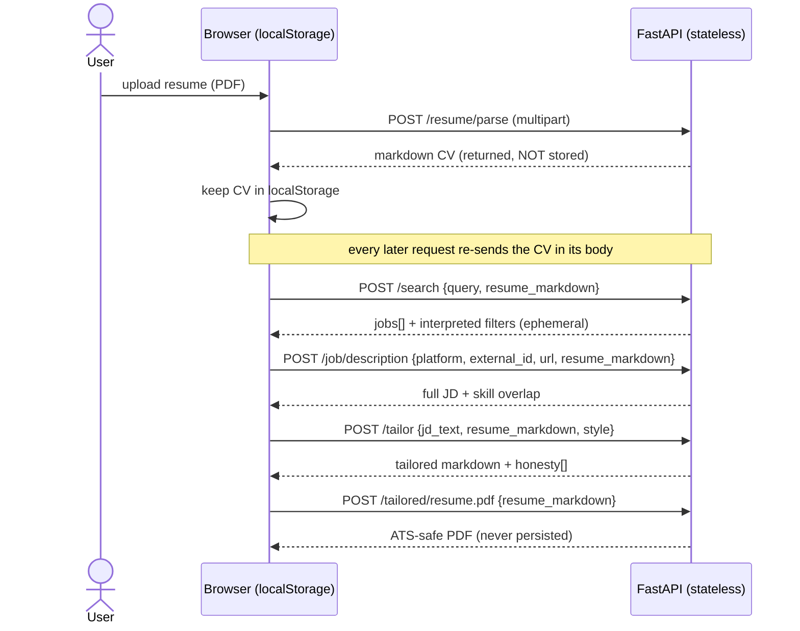
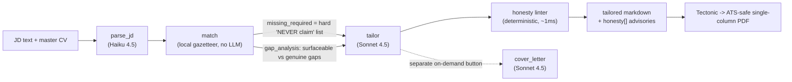
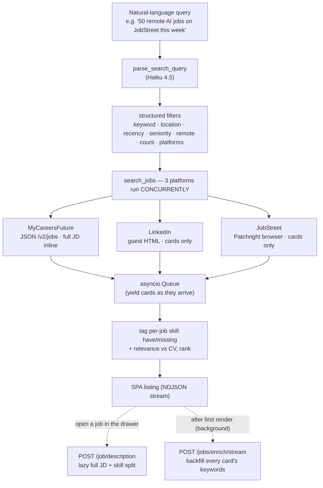
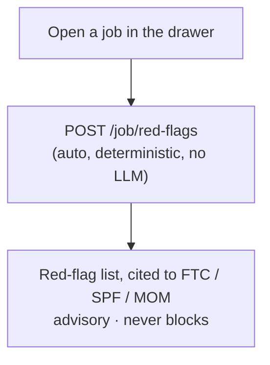
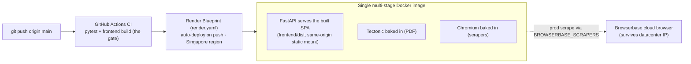

# Overlap

**See where your CV and the job overlap — then tailor to it.**

Overlap is a **stateless** AI resume-tailoring + job-search web app for AI/ML/LLM roles in Singapore. It does two things:

1. **Tailor your resume** to a specific job — ATS-safe, keyword-exact, and honest (it never invents skills or history you don't have), rendered to a clean LaTeX PDF.
2. **Search live jobs** across three platforms at once, showing exactly which of each posting's skills your CV already covers, plus a **job-intel panel** that flags scam/ghost postings.

> **No login, no database.** Your CV is parsed once in the browser and kept in `localStorage`; every request is a pure function of its body. Nothing you upload is stored server-side, so anyone can try it instantly.

---

## Table of contents

- [How it works](#how-it-works)
  - [Architecture](#architecture)
  - [Stateless by design](#stateless-by-design)
  - [Resume tailoring](#1-resume-tailoring)
  - [Live job search](#2-live-job-search)
  - [Job-intel panel](#3-job-intel-panel)
  - [The local matching engine](#the-local-matching-engine)
- [Tech stack](#tech-stack)
- [Endpoints](#endpoints)
- [Setup](#setup)
- [Run it](#run-it)
- [Tests](#tests)
- [Deployment](#deployment)
- [Project layout](#project-layout)
- [Troubleshooting](#troubleshooting)

---

## How it works

### Architecture

A React single-page app talks to a stateless FastAPI backend over JSON. The backend is a set of **pure functions of the request body** — it calls out to Claude for the language-heavy steps, to a local deterministic matcher for skill scoring (no LLM), to Tectonic for PDF rendering, and to three job scrapers. Nothing is persisted.



### Stateless by design

The CV is uploaded once (PDF → markdown), returned to the client, and kept in `localStorage`. It is then **re-sent in the body of every subsequent request**. Search results and tailored output are ephemeral. There is no auth, no session, and no database — which is what makes it a safe, instantly-shareable demo.



### 1. Resume tailoring

Tailoring is a **LangGraph state machine** (`parse_jd → match → tailor → cover_letter`), with the master CV threaded through the state.

- **`parse_jd`** (Claude **Haiku 4.5**) extracts the posting's required/preferred skills.
- **`match`** runs the **local deterministic matcher** (no LLM) to compute which JD skills the CV supports and, crucially, which it doesn't — the latter becomes a hard **"never claim these"** list handed to the tailor.
- **`tailor`** (Claude **Sonnet 4.5**) rewrites the resume: mirrors the JD's exact keyword wording *where the CV supports it* (ATS parsers weight literal matches), preserves your metrics, reorders by relevance, and targets **one page**.
- **`cover_letter`** (Sonnet, optional) is a separate on-demand step against the (edited) resume.

Honesty is **code-enforced, not just prompted**: a deterministic **honesty linter** post-checks the output for fabrication — an invented role/project heading, a metric not in the CV, or an industry/compliance term the CV never used — and returns advisories the UI surfaces. Fabrication means inventing *history*; adding a JD skill to the Skills section (for ATS coverage) is the tailor's job and is allowed.

**Three tailoring styles** trade editorial latitude while keeping the honesty rules identical: `faithful` (keep all, reorder/rephrase) · `balanced` (condense, ~1 page) · `aggressive` (restructure + cut low-relevance sections, hard 1 page). A **one-page budget estimator** (calibrated so ~55 rendered lines ≈ one page) drives a live "≈1 page ✓ / trim ~N lines" badge as you edit.



The tailored resume (and the uploaded CV) are edited in a **WYSIWYG editor** — rich-text on the surface, markdown as the source of truth — with a **side-by-side live preview** that approximates the final layout and shows the one-page badge as you type. A **Fit to page** action re-tailors to the nearest full page when content spills a small remainder onto an under-used extra page. The PDF renders from your edits via an ATS-safe single-column LaTeX template (Latin Modern, T1/ToUnicode so text extracts cleanly, plain `\section`, no tables/multicol/floats) compiled by **Tectonic**. Output is never stored.

### 2. Live job search

A natural-language query ("50 remote AI Engineer jobs on JobStreet this week") is parsed by Haiku into structured filters (keyword, location, recency, seniority, remote, count, platforms). The three platforms are then scraped **concurrently** — wall-clock ≈ the slowest platform, not the sum — with jobs streamed to the client (NDJSON) as they arrive.

To stay fast and avoid tripping platform soft-walls, LinkedIn/JobStreet return **cards only**; full descriptions are fetched **on demand** when a job is opened, and every card's keywords are **backfilled in the background** after the first render. Each job is tagged with per-JD skill have/missing and a relevance score against the CV. Large searches (up to 300) spread a **weighted per-platform budget** so a fast source can't starve the slower ones, and an optional **learned fit predictor** re-ranks the combined results — surfaced as a relative **Strong / Moderate / Weak** tier plus a *top-fit* marker, not a misleading absolute score.



**Insights** (`/insights`) is a deterministic, no-LLM aggregation over the current result set: most in-demand skills, which you have, coverage, salary range, platform mix.

### 3. Job-intel panel

Opening a job in the drawer runs a **deterministic-first**, stateless legitimacy check:

- **Legitimacy red-flags** (`/job/red-flags`, no LLM, ~1ms) — scans the posting for documented scam/ghost signals (upfront-payment asks, WhatsApp/Telegram-only contact, personal-email domains, NRIC/bank-detail requests, too-good-to-be-true pay, urgency, vague JD, unlicensed agency via missing **MOM EA licence**, stale posting age, evergreen phrasing). Each flag cites a primary source (FTC / SPF / MOM). Advisory — it never blocks.

> A **contacts** tool (email-pattern / LinkedIn-poster inference) previously shipped here but was removed in 2026-07 — it could only ever resolve the company email *domain*, not a specific person's address.



### The local matching engine

`src/matching/` is a curated AI/ML/data/cloud **skills gazetteer** (canonical terms → aliases) plus a deterministic phrase matcher. It resolves `torch → PyTorch`, `k8s → Kubernetes`, handles `C++`/`C#`/`Node.js`, and avoids false hits (`java` inside `javascript`, a bare `go`). It powers per-job skill overlap, the tailoring pipeline's honesty gate, search-result ranking, and insights — **free, ~1 ms, exact-repeatable**, with no LLM call per job.

---

## Tech stack

| Layer | What | Why |
|-------|------|-----|
| **Backend** | FastAPI + Uvicorn (async, request-id logging), per-IP rate limiting | Stateless JSON API |
| **Agents** | LangGraph + LangChain + `langchain-anthropic` | Orchestrates `parse_jd → match → tailor → cover_letter` |
| **LLM** | Anthropic **Claude Haiku 4.5** (JD parse, NL query, JD clean-up) + **Sonnet 4.5** (tailor, cover letter) | Cheap model for parsing, quality model for writing |
| **Matching** | Local gazetteer matcher (`src/matching/`) | Deterministic skill scoring, no LLM, ~1 ms |
| **Resume in** | `markitdown` | Uploaded resume PDF → markdown |
| **Resume out** | Markdown → LaTeX → **Tectonic** (`-X compile`) | ATS-safe single-column PDF; never stored |
| **Scrapers** | `httpx` + `beautifulsoup4` (LinkedIn guest, MyCareersFuture JSON), **Patchright** (JobStreet stealth browser) | Live multi-platform search |
| **Cloud browser** | **Browserbase** (optional) | Reliable LinkedIn/JobStreet fetch from datacenter IPs in prod |
| **Observability** (optional) | **LangSmith** tracing + Hub prompts (off by default, PII-redacted) | Trace LLM calls + version prompts in a playground |
| **Config / schemas** | Pydantic + `pydantic-settings` + `python-dotenv`; `tenacity` (retries); `rich` (CLI) | Typed settings & agent outputs |
| **Frontend** | Vite 8 + React 19 + TypeScript | Single-page app (`App.tsx`) |
| **UI** | Tailwind CSS v4 + shadcn/ui + Radix UI + `next-themes` + `sonner`; `lucide-react` icons; Geist / JetBrains Mono / Space Grotesk fonts | Themed, accessible components |
| **Editor / markdown** | TipTap (`@tiptap/react` + `tiptap-markdown`) + custom preview | WYSIWYG resume editor (markdown under the hood) + instant template-approximating preview |
| **Data / state (FE)** | `@tanstack/react-query`; results cached in `localStorage` | Resilient, refresh-surviving UX |
| **Tests** | `pytest` (+ `asyncio`, `cov`, `mock`, `respx`) backend; Vitest + Testing Library frontend | |
| **Quality** | `ruff`, `mypy --strict`, `pre-commit` | |
| **Deploy** | Docker (multi-stage) + Render Blueprint + GitHub Actions CI | Single image, auto-deploy on push to `main` |

**Optional extras (dev/experiment only, never in prod):**

- `[eval]` — **MLflow** experiment tracking + **OpenAI** LLM-as-judge for the prompt-eval harness (`evals/`). The judge is deliberately cross-provider (app = Claude, judge = OpenAI).
- `[predictor]` — **ONNX Runtime** + `tokenizers` to serve a resume↔JD fit predictor (flag-gated, off by default).
- `[train]` — the GPU training box for that predictor (PyTorch, Lightning, SBERT, PEFT, etc.).

---

## Endpoints

No auth headers — all endpoints are open (CORS-limited to configured origins). Auto-generated docs at `/docs`. The paid/scraping endpoints sit behind a per-IP rate limiter.

| Method | Path | Notes |
|--------|------|-------|
| `GET`  | `/health` | Liveness probe |
| `POST` | `/resume/parse` | multipart PDF → markdown (returned, not stored) |
| `POST` | `/search` | `{query, resume_markdown?}` → `{jobs[], interpreted}` |
| `POST` | `/search/stream` | same input → NDJSON stream (progressive results) |
| `POST` | `/jobs/enrich/stream` | `{jobs[], resume_markdown?}` → NDJSON stream backfilling card keywords |
| `POST` | `/job/description` | `{platform, external_id, url, resume_markdown?}` → on-demand full JD + skill split |
| `POST` | `/job/red-flags` | `{description, company, salary_*, url, posted_date}` → `{flags[]}` (deterministic, no LLM) |
| `POST` | `/score` | `{jd_text, resume_markdown}` → match + gap split (no LLM scoring; 1 Haiku parse) |
| `POST` | `/insights` | `{jobs[], resume_markdown?}` → deterministic skill-demand aggregation (no LLM) |
| `POST` | `/tailor` | `{jd_text, resume_markdown, style?, concise?, target_pages?}` → tailored resume + `honesty[]` |
| `POST` | `/cover-letter` | `{jd_text, resume_markdown}` → cover letter |
| `POST` | `/extract-jd` | `{url}` → JD text scraped + cleaned from a URL |
| `POST` | `/tailored/resume.pdf` | `{resume_markdown, download?}` → PDF |
| `POST` | `/tailored/cover-letter.pdf` | `{cover_letter_text, download?}` → PDF |

---

## Setup

### Prerequisites

| Tool | Version | Notes |
|------|---------|-------|
| Python | 3.10 – 3.12 | `pyproject.toml` requires `>=3.10` |
| Node | 20+ | Vite 8 / React 19 |
| Anthropic API key | — | Claude Haiku 4.5 + Sonnet 4.5 (**required**) |
| Tectonic | latest | LaTeX → PDF. Must be on `PATH`. First compile downloads the TeX bundle once. |
| Playwright/Patchright browser | `patchright install chromium` | JobStreet scrape |

Windows, macOS, and Linux all work. The PDF render path has a Windows-specific asyncio shim (uvicorn's `SelectorEventLoop` can't spawn subprocesses); no action needed.

### 1. Clone and create a virtualenv

```bash
git clone https://github.com/darinatic/JobAssistant.git
cd JobAssistant
python -m venv .venv

# Windows
.venv\Scripts\activate
# macOS / Linux
source .venv/bin/activate

pip install -e ".[dev]"
patchright install chromium
```

### 2. Install Tectonic (for PDF rendering)

```bash
# macOS / Linux
cargo install tectonic          # or: brew install tectonic
# Windows
scoop install tectonic          # or grab the release binary and put it on PATH
```

Missing Tectonic isn't fatal — the app runs, but the PDF endpoints return a clear `503` until it's installed.

### 3. Environment variables

Copy `.env.example` to `.env` and fill in:

```env
ANTHROPIC_API_KEY=sk-ant-...
CORS_ORIGINS=http://localhost:5173,http://localhost:3000
LOG_LEVEL=INFO
# optional — model overrides (defaults shown)
ANTHROPIC_HAIKU_MODEL=claude-haiku-4-5-20251001
ANTHROPIC_SONNET_MODEL=claude-sonnet-4-5-20250929
# optional — cloud browser for LinkedIn/JobStreet (falls back to the free path when unset)
BROWSERBASE_API_KEY=
BROWSERBASE_PROJECT_ID=
```

### 4. Frontend

```bash
cd frontend
npm install
```

Optionally create `frontend/.env` to point at a non-default backend:

```env
VITE_API_URL=http://127.0.0.1:8000
```

---

## Run it

Two terminals — one per side.

```bash
# Terminal A — backend  (docs at http://127.0.0.1:8000/docs)
python -m src.main serve
```

```bash
# Terminal B — frontend  (http://localhost:5173)
cd frontend
npm run dev
```

Upload your resume PDF, then either **search** live jobs or **paste a JD / URL**, open a job, and tailor. No sign-in.

There's also a CLI: `resume-agent process` (reads the CV from a local `master_cv.md`), plus `interactive`, `search`, and `serve` subcommands.

---

## Tests

```bash
# Backend
pytest tests/ -v

# Single file
pytest tests/test_search.py -v

# Frontend build (type-check + bundle)
cd frontend && npm run build

# Frontend unit tests
cd frontend && npm test
```

The Tectonic end-to-end PDF test skips automatically when the binary isn't installed. CI (`.github/workflows/ci.yml`) runs the backend suite + frontend build as the deploy gate.

---

## Deployment

A single multi-stage **Docker** image: FastAPI serves the built SPA from `frontend/dist` (same-origin static mount), with **Tectonic + Chromium baked in**. It deploys to **Render** via a Blueprint (`render.yaml`, Singapore region, `/health` check). **Render auto-deploys on push to `main`**; GitHub Actions runs tests + the frontend build as the gate. In production, scraping is routed through **Browserbase** (`BROWSERBASE_SCRAPERS=true`) so browser scraping survives the datacenter IP. Per-IP rate limiting guards the paid endpoints.



---

## Project layout

```
resume-agent/
├── README.md                       # this file
├── Dockerfile · render.yaml        # single-image deploy (Render Blueprint)
├── pyproject.toml · .env.example
├── img/                            # Mermaid (.mmd) diagram sources for this README
├── src/
│   ├── api.py                      # stateless FastAPI app (all endpoints)
│   ├── rate_limit.py               # in-memory per-IP rate limiter
│   ├── services.py                 # parse → match → tailor → cover letter
│   ├── search.py                   # concurrent multi-platform search + on-demand descriptions
│   ├── search_nlp.py               # natural-language query → structured filters (Haiku)
│   ├── insights.py                 # deterministic skill-demand aggregation
│   ├── jd_extract.py               # URL → JD text (httpx + BeautifulSoup + Haiku)
│   ├── main.py                     # CLI: process / interactive / search / serve
│   ├── matching/                   # gazetteer.py + local_matcher.py — deterministic scorer
│   ├── intel/                      # red_flags.py + schemas.py — job-intel panel (legitimacy red flags)
│   ├── agents/                     # schemas + jd_parser + resume_tailor + cover_letter + skills_matcher
│   ├── graph/                      # workflow.py + state.py (LangGraph)
│   ├── prompts/                    # versioned prompt registry
│   ├── scrapers/                   # base + mycareersfuture + linkedin + jobstreet
│   ├── browser/                    # Patchright stealth profile (JobStreet)
│   ├── match_predictor.py          # optional ONNX fit predictor (flag-gated, off by default)
│   └── utils/                      # config.py + latex_renderer.py + pdf_converter.py
├── evals/                          # dev-only prompt-eval harness (golden set, graders, MLflow, OpenAI judge)
├── frontend/                       # Vite + React 19 + TS + Tailwind v4 + shadcn/ui (single-page App.tsx)
└── tests/                          # pytest
```

---

## Troubleshooting

**PDF endpoints return `503`** — Tectonic isn't on `PATH`. Install it (see Setup) and restart the backend.

**LinkedIn/JobStreet jobs have no skill tokens in the list** — those descriptions are fetched on demand; open the job in the drawer and its full JD + skill overlap load in. Search returns them as cards only, by design.

**LinkedIn returns 0 jobs / missing descriptions after a few runs** — the guest endpoint soft-walls after ~5–10 quick requests. Wait a while, lower `max_jobs`, name a different platform, or set `BROWSERBASE_API_KEY` + `BROWSERBASE_PROJECT_ID` to fetch LinkedIn descriptions through a cloud browser (residential proxies via `BROWSERBASE_PROXIES=true` need a paid plan).

**JobStreet returns 0 jobs** — Cloudflare needs a real browser fingerprint. Make sure `patchright install chromium` ran and the stealth profile in `src/browser/` is intact. JobStreet's browser startup is the slow tail of every search (~15–20 s).

**`Can't reach the server`** — the backend isn't running on the expected port. Start it (`python -m src.main serve`) or set `VITE_API_URL`.

---

## License

MIT — see `pyproject.toml`.
